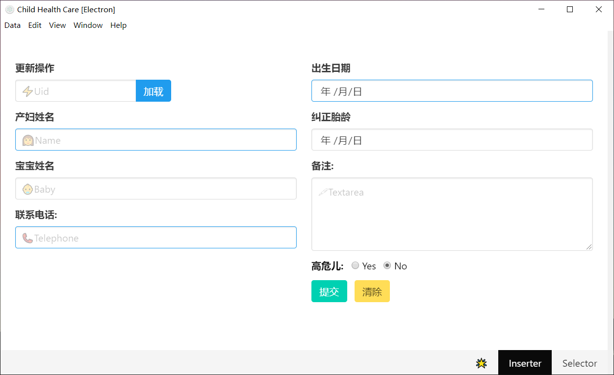
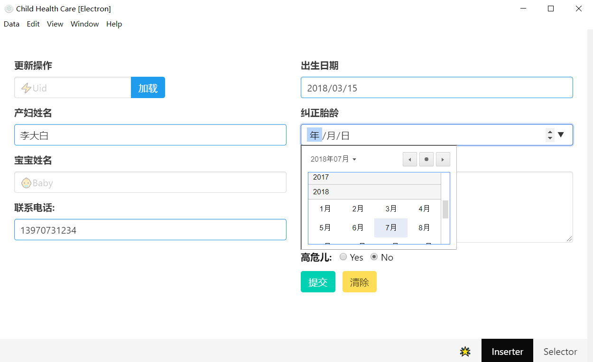
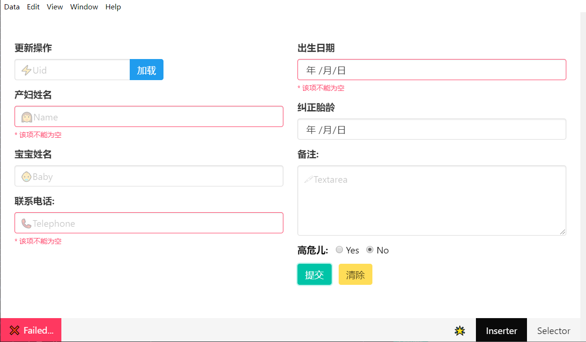
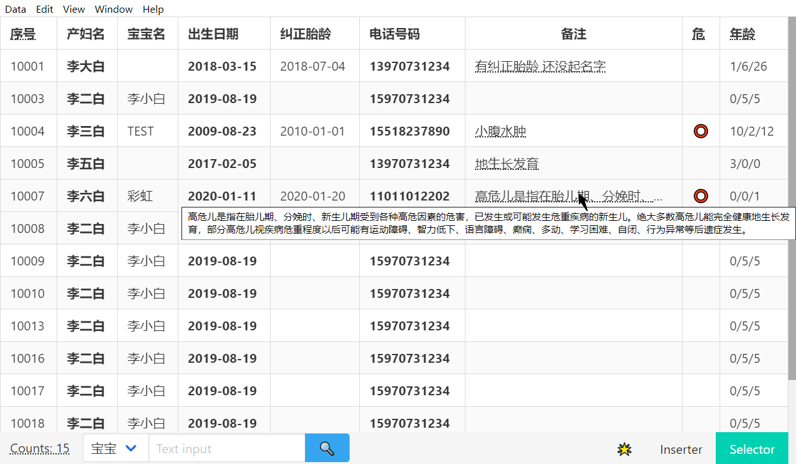
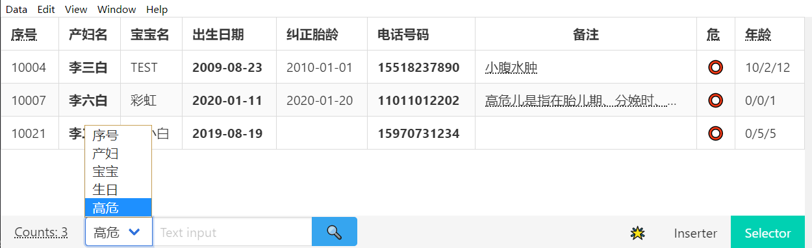
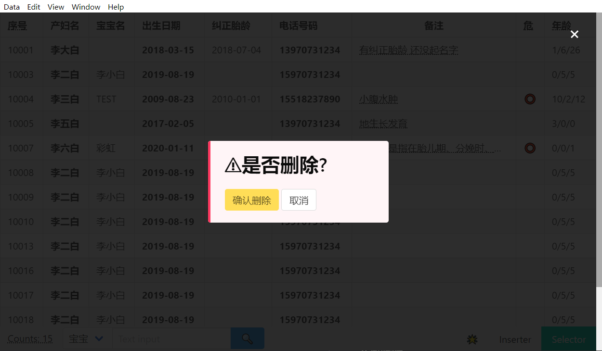
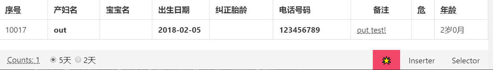
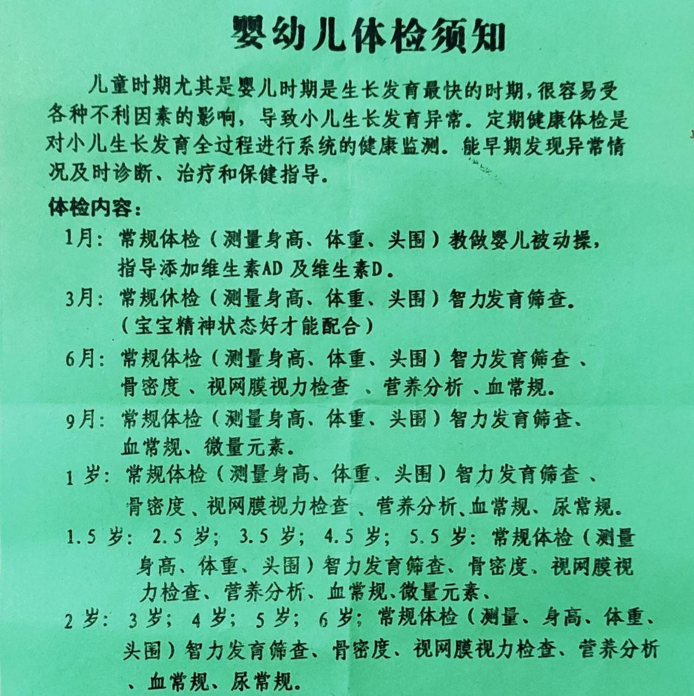

# Child_Health_Electron

[](https://github.com/symant233/Child_Health_Electron/archive/master.zip) [](https://github.com/symant233/Child_Health_Electron/blob/master/LICENSE) [](https://ci.appveyor.com/project/symant233/child-health-electron)


> 使用Electron和Vue.js构建的一款儿童保健数据库管理桌面应用.

## 主要功能
 - 对数据库进行 插入/删除/更新/选择 操作
 - 插入或更新用户信息 [`Inserter.vue`]
 - 动态生成html的table界面 [`Selector.vue`]
 - 表格展示需要电话通知体检的用户信息 [`Telephone.vue`]
 - 备份数据库, 打印页面, 设置语言等

### Inserter界面



时间控件能方便的选择年月日:



点击提交 操作成功左下角会显示信息 停留1.5s自动消失:


其中有三项是必须的 如果有一项没有输入且点击提交 页面会显示错误信息:



> 更新操作:
> 在左上角Uid输入要更新的用户的序号(可以在Selector中查找到)
> 点击加载, 会将该用户信息加载到对应输入框中, 更改后点提交按钮更新

### Selector界面



Tips: 
1. 高危儿会用醒目标识⭕标志出来, 年龄是以 `年/月/日` 给出的,
2. 计算是由距离今日的精确天数按一月30天计算. 
3. 左下角有当前总共的人数, 点击该按钮刷新当前界面.
4. 序号是只增不减的, 防止覆盖已存在用户, 简化删除操作与管理.
5. 过长的备注会被省略, 鼠标移上去会显示完全信息 (`<abbr>`实现).

选择底部的`<options>`决定检索哪一个属性, 输入后点按钮会动态显示结果. (如选择"高危"则不用在输入框中输入, 直接点击按钮就会刷新界面) `Ctrl+9`还原初始界面大小 (详见[菜单栏](#菜单栏))



删除: 点击左侧的序号 会弹出确认删除界面, 点确认则删除该选中uid的用户: 
(PS: 动态显示的表格会移除该行)




### Telephone界面

🌟 列出还有两天或者五天 (可选择) 即满足年龄的用户信息, 以便电话通知.





## 菜单栏
```
Data:
    Folder:
        Open Data Folder: 打开当前数据库的位置
        Open Backup Folder: 打开备份的位置
    Backups:
        Run Backup: 立即备份 (每次关闭程序会自动备份)
        Set Backup Path: 选择备份的路径 (备份前需要设置)
        Set Backup Series: 设置备份序列
    Languages:
        English: 设置菜单栏语言为英文
        Chinese: 设置菜单栏语言为中文
Edit: ... 一些原生编辑操作
View: ... Browser窗口的zoom和刷新
Window: ... 
    Default Size: 设置应用窗口为默认大小
Help: 
    About: 应用的关于dialog
    Release: Github Release链接
    Print: 打印机
    Print To PDF: 导出成PDF
    DevTools: 开发者工具
```

## 获取应用

> Release下载: https://github.com/symant233/Child_Health_Electron/releases

#### 从源码构建

``` bash
# clone this repository
git clone https://github.com/symant233/Child_Health_Electron.git

cd Child_Health_Electron

# install dependencies
npm install

# serve with hot reload at localhost:9080
npm run dev

# build electron application for production
npm run build
```

---

本项目使用 [electron-vue](https://github.com/SimulatedGREG/electron-vue)@[45a3e22](https://github.com/SimulatedGREG/electron-vue/tree/45a3e224e7bb8fc71909021ccfdcfec0f461f634) using [vue-cli](https://github.com/vuejs/vue-cli). 文档: [here](https://simulatedgreg.gitbooks.io/electron-vue/content/index.html).
